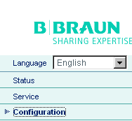
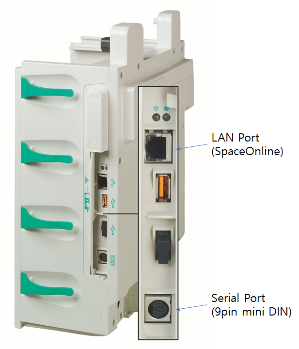

# BBraun SpaceCom

<!-- meta
category: Syringe Pump
manufacturer: B. Braun
vr_device_name: SpaceCom
-->
> **Note:** Configured via a **web interface (SpaceOnline)** over direct LAN connection.

| Cable | Adapter | Port | VR Device Name |
|-------|---------|------|----------------|
| Custom 9-pin Mini-DIN ↔ DB-9F | None | Mini-DIN port | `SpaceCom` |

## Connection Steps
1. Fabricate a cable: **Mini-DIN pins 2, 3, 5** → **DB-9F pins 3, 2, 5**.
2. Connect to the SpaceCom and to the PC via USB-Serial converter.

## Device Configuration
1. Connect SpaceCom to PC with a **direct LAN cable**. Set PC IP: `192.168.100.42` / Subnet: `255.255.255.0` / Gateway: `192.168.100.1`.
2. Open browser → `192.168.100.41` → login: `config` / `config`.

   

3. Navigate to **BCC Protocol settings** and configure as shown.

   

4. Press **Save**.
