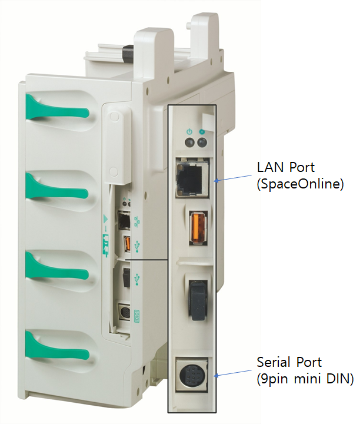
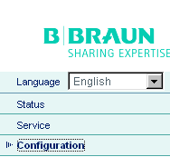
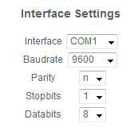

# B. Braun SpaceCom

<!-- meta
category: Syringe Pump
manufacturer: B. Braun
vr_device_name: SpaceCom
-->
> ⚠️ **Two ports, two jobs.** Data is recorded from the **9-pin mini-DIN serial port** at the bottom of the SpaceCom module, but the serial interface must first be enabled and its parameters set through the **SpaceOnline web interface**, reached over the **LAN (RJ-45) port** higher up on the same module.

| Cable | Adapter | Port | VR Device Name |
|-------|---------|------|----------------|
| Custom 9-pin mini-DIN ↔ DB-9F | None | Serial (9-pin mini-DIN), bottom of the SpaceCom module | `SpaceCom` |
| Ethernet patch cable (configuration only) | None | LAN (RJ-45), SpaceOnline | — |

A standard serial cable will not fit — the pump side is a 9-pin mini-DIN, so a custom or B. Braun-supplied cable is required. No Null Modem adapter is used; the crossover is in the custom cable's pin mapping.

## Connection Steps
1. Identify the two ports on the SpaceCom module's connector column: the **LAN port (SpaceOnline)** near the top, below the two status LEDs, and the **serial port (9-pin mini-DIN)** at the bottom of the column.

   

2. Prepare the cable mapping **mini-DIN pins 2, 3, 5** → **DB-9F pins 3, 2, 5** (RxD / TxD / GND, crossed). Only three conductors are needed. **Verify the mapping against B. Braun documentation for the specific SpaceCom revision before wiring** — the pin assignment is not published in the SpaceStation user manual.
3. Connect the mini-DIN end to the SpaceCom serial port and the **DB-9F end** to the PC via a USB-Serial converter.

## Device Configuration

The serial interface is configured over LAN through **SpaceOnline**, the module's built-in web interface.

1. Connect the SpaceCom **LAN port** to the PC with an Ethernet cable and give the PC a static address on the module's subnet:
   - PC IP: `192.168.100.42` / Subnet: `255.255.255.0` / Gateway: `192.168.100.1`
   - The SpaceCom's own default Ethernet address is **`192.168.100.41`**.
2. Open a browser to **`192.168.100.41`** and log in. B. Braun ships three fixed accounts, each opening a different page — use the configuration one:
   - `status` / `status` — status page
   - `service` / `service` — service page
   - **`config` / `config` — configuration page**
3. Select **Configuration** in the left-hand menu. Set **Language** to *English* first if the interface came up in another language.

   

4. Open **BCC Protocol settings** (its panel is titled *Interface Settings*) and set the serial parameters:

   

5. Press **Save**. Power-cycle the SpaceStation so the interface comes up with the new settings.

- Interface: **COM1**
- Serial: **9600 baud, 8 data bits, No parity (`n`), 1 stop bit**
- B. Braun's manual states these four values are chosen to match the requirements of the receiving PDM system — the values above are those used with Vital Recorder. If they are changed on the pump, the matching change must be made on the recorder side.

## Vital Recorder Setup

- Add the device in Vital Recorder as **`SpaceCom`**.

## Notes
- The SpaceCom is the communication module of the **SpaceStation** rack; it reports the infusion pumps (Perfusor / Infusomat Space) docked in that rack, so one `SpaceCom` device in Vital Recorder covers the whole station rather than one entry per pump.
- **Configuration is mandatory** — an unconfigured SpaceCom links up electrically but transmits nothing.
- After a firmware update or a factory reset the interface settings return to their defaults. Re-check **Interface Settings** first when a previously working station stops producing tracks.
- Restore the PC's Ethernet adapter to DHCP after configuration if it is also used on the hospital network.
