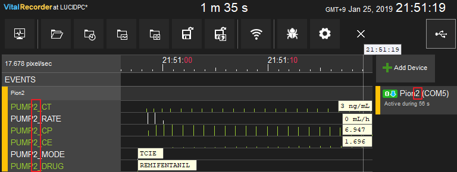
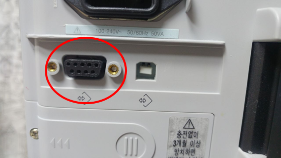

# Bionet Pion TCI

<!-- meta
category: Syringe Pump
manufacturer: Bionet
vr_device_name: Pion
-->
> **Note:** When multiple Pion pumps are connected, Vital Recorder identifies each by the number in its device name. A device named **"Pion2"** produces tracks prefixed with **PUMP2**; no number defaults to **PUMP1**.

| Cable | Adapter | Port | VR Device Name |
|-------|---------|------|----------------|
| Direct Serial | None | 9-pin port | `Pion` |

## Connection Steps
1. Connect a direct serial cable to the **9-pin port** on the rear.
2. Connect the other end to the PC via USB-Serial converter.
3. In Vital Recorder, name the device `Pion1`, `Pion2`, etc. to match the pump number.

   

   
