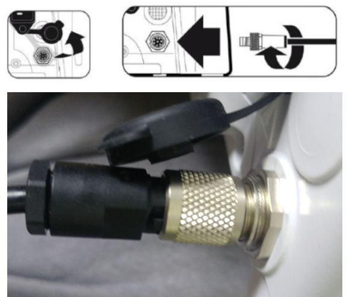

# Fresenius Kabi Agilia

<!-- meta
category: Syringe Pump
manufacturer: Fresenius Kabi
vr_device_name: Agilia
-->
> **Note:** Requires a **proprietary cable from Fresenius Kabi** (~130,000 KRW). The cable ends in DB-9 female on the output side — connects directly to a USB-Serial converter with no gender adapter needed.

| Cable | Adapter | VR Device Name |
|-------|---------|----------------|
| Proprietary Fresenius Kabi cable (DB-9F output) | None | `Agilia` |

## Connection Steps
1. Obtain the proprietary cable from Fresenius Kabi.
2. Connect the device side to the Agilia.
3. Connect the **DB-9F end directly** to a USB-Serial converter (no adapter needed).
4. Connect the USB-Serial converter to the PC.

   
