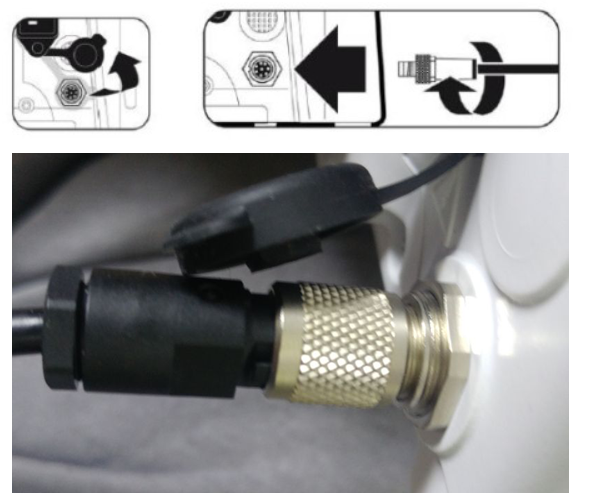

# Fresenius Kabi Agilia

<!-- meta
category: Syringe Pump
manufacturer: Fresenius Kabi
vr_device_name: Agilia
-->
> ⚠️ **A proprietary Fresenius Kabi cable is required and must be purchased** (approx. 130,000 KRW). The pump side is a circular screw-lock connector — no generic serial cable will fit, and none can be substituted.

| Cable | Adapter | Port | VR Device Name |
|-------|---------|------|----------------|
| Proprietary Fresenius Kabi cable (7-pin mini-DIN pump side, DB-9F output) | None | Serial (7-pin mini-DIN, circular screw-lock), pump housing | `Agilia` |

The cable's output end is DB-9 **female**, which mates directly with the DB-9 male of a PC serial port or USB-Serial converter. **No Null Modem adapter is used** — the crossover is built into the proprietary cable.

## Connection Steps
1. Obtain the proprietary cable from Fresenius Kabi. There is no documented pinout to build one from.
2. Flip open the rubber cap over the pump's circular connector, align the plug with the keyway, insert it, and **tighten the knurled locking collar** by hand until the connector is seated. The collar is what retains the plug — an un-tightened connector works loose during use.

   

3. Connect the **DB-9F end directly** to a USB-Serial converter — no adapter in between.
4. Connect the USB-Serial converter to the PC.

## Device Configuration
- No configuration is required on the pump. No service menu, code or output option has to be enabled — the proprietary cable alone completes the connection.

## Vital Recorder Setup

- Add the device in Vital Recorder as **`Agilia`**.

## Notes

- **Vital Recorder version:** run the latest release (see the [official version history](https://vitaldb.net/vital-recorder/?action=versions)); device-related version notes are collected in [version-notes.md](../version-notes.md).
- This page covers a **standalone Agilia pump** cabled directly to the PC. Where several Agilia SP / VP modules are mounted on a **Link+ / Agilia Link rack**, use the rack's USB connection instead and configure it as the `Link+` device — see [Fresenius Kabi Link+ Agilia](fresenius_link_agilia.md). Do not cable individual pumps separately when a Link+ rack is present.
- Keep the rubber cap closed when the cable is not fitted; the connector is on the pump exterior and is exposed to fluid spills.

## Sources

- Original Vital Recorder connection guide (legacy English and Korean editions) — Agilia device table (serial 7-pin mini-DIN, dedicated cable purchase required, no setting required) and the Agilia section: proprietary cable obtained from Fresenius Kabi at about 130,000 KRW, DB-9 female cable end mating directly with a USB-Serial converter without an adapter.
- `VitalRecorder/Supported_Devices.md` — *Agilia / Link+, Fresenius Kabi, RS-232, 115200 baud, infusion volume / rate / alarm status*.
- Rubber cap, keyway and knurled locking collar of the circular connector: pictogram and photograph in this guide.
- Vital Recorder official version history — <https://vitaldb.net/vital-recorder/?action=versions>; device-related entries in [version-notes.md](../version-notes.md).
