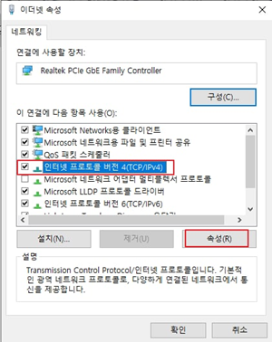
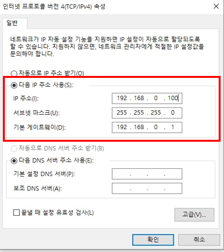
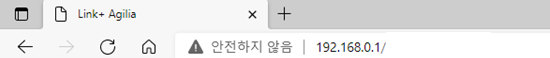
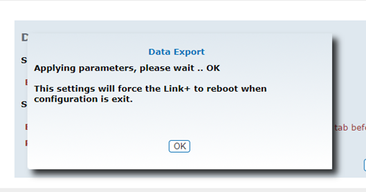

# Fresenius Kabi Link+ Agilia

<!-- meta
category: Syringe Pump
manufacturer: Fresenius Kabi
vr_device_name: Link+
-->
> **Note:** Data is recorded through USB. Enable Data Export through the LAN connection before recording.

| Cable | Adapter | Port | VR Device Name |
|-------|---------|------|---------------- |
| USB 2.0 A-male ↔ mini-B 5-pin | None | USB-B (mini-USB)| `Link+` |

## Connection Steps
1. Connect the **mini-B end** to that port and the **USB-A end** directly to the PC. No USB-Serial converter is needed — the rack presents itself as a USB CDC-ACM serial device.
## Device Configuration

   

Enabling **Data Export** is a **one-time** procedure performed over LAN from a PC. It must be done before the USB connection will produce any data.

1. Connect the Link+ **LAN (RJ-45) port** — on the left of the same connector panel — to the PC's Ethernet port with the LAN cable supplied with the Link+.

   

2. On the PC, open **Control Panel → Network and Internet → Network Connections**, right-click the **Ethernet** adapter and choose **Properties**.

   

3. In the adapter properties list, select **Internet Protocol Version 4 (TCP/IPv4)** and click **Properties**.

   

4. Choose **Use the following IP address** and enter a static address on the rack's subnet:
   - IP address: `192.168.0.100`
   - Subnet mask: `255.255.255.0`
   - Default gateway: `192.168.0.1`

   Click **OK**.

   

5. Open a browser and navigate to **`192.168.0.1`**. The Link+ Agilia configuration page loads. The browser will warn that the connection is not secure — this is expected for the device's local HTTP server.

   

6. On the authorized local setup connection, log in at the **Identification — Password** prompt (ID `admin` / password `fresenius`; if these are rejected, obtain the current credentials from Fresenius Kabi service).

   

7. Open the **Configuration** menu and select **Data Export**.

   

8. Under **Serial export protocol for Agilia SP and VP**, tick **Enabled**, then click **Apply**.
   

9. A dialog confirms the parameters were applied and warns that the Link+ will reboot when configuration is exited. Click **OK**.

   

10. Click **Exit Configuration**. The rack reboots on its own, which completes the setup.

## Vital Recorder Setup

- Add a device with **Device Type `Link+`** and leave **Port** empty. Vital Recorder finds the rack by its USB ID and follows it when it re-connects under a new port number. Leave **Y Cable** unchecked.

## Troubleshooting

- **Crashes or a failed reconnection on an older build.** Several Link+-specific crashes and a reconnection failure were fixed across 1.18.50–1.19.5; upgrade before troubleshooting hardware.
