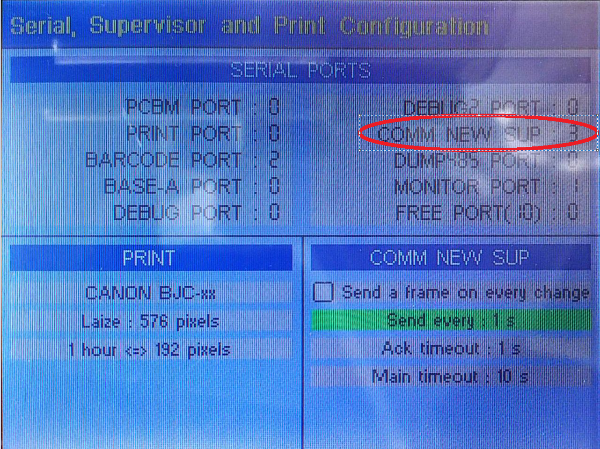
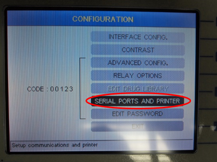
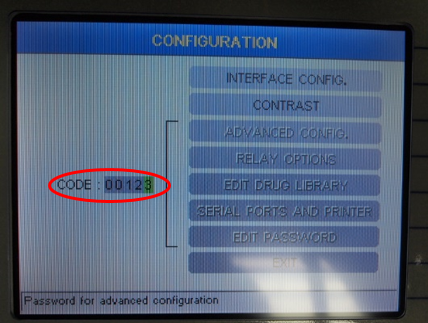
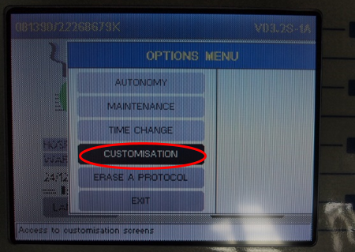
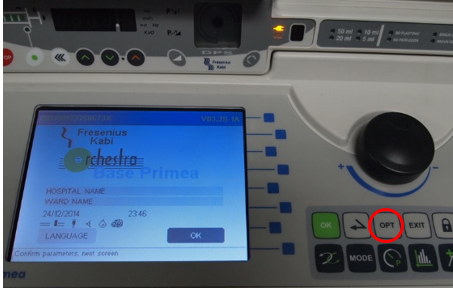
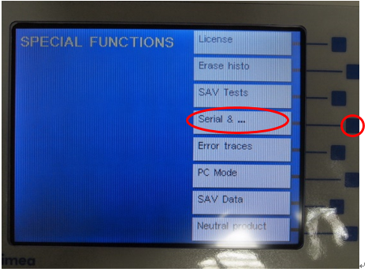
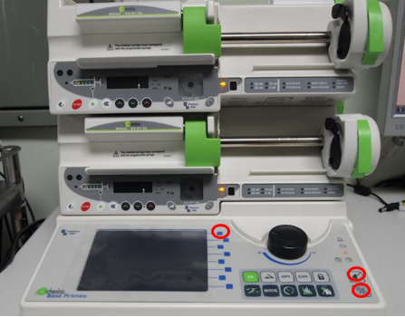

# Fresenius Vial Orchestra (Base Primea with Module DPS)

<!-- meta
category: Syringe Pump
manufacturer: Fresenius Kabi
vr_device_name: Orchestra
-->
> ⚠️ **A cross (M/F Cross Gender) adapter is required.** Connecting a direct cable causes incorrect communication or hardware damage.

| Cable | Adapter | Port | Protocol | VR Device Name |
|-------|---------|------|----------|----------------|
| Direct Serial | Null Modem M/F | RS 232-3 — **rightmost** of three serial ports (Base Primea) | IDMS | `Orchestra` |

## Connection Steps
1. Attach a **Null Modem (M/F)** to the **RS 232-3** port (rightmost).
2. Connect a direct serial cable to the PC via USB-Serial converter.

   

## Device Configuration
1. Power off. Hold **top blue button + mute button + power button** simultaneously → enter service mode.

   

2. Press the **fourth blue button** → **"Serial & ..."**.

   

3. In **SERIAL PORTS**, select **COM NEW SUP** (second item, upper right) via jog dial → select **3**.

   

4. Uncheck **"Send a frame on every change"** for COMM NEW SUP. Set **"Send every" → 1s**.
5. Power off → power on → press **OPT** button (lower right).

   

6. Select **CUSTOMIZATION → CODE → `00123`**.

   

7. Select **SERIAL PORTS AND PRINTER → RS-232-3 → IDMS**.

   

8. Confirm **RS 232-3 = IDMS** → **save and exit** → power cycle.
