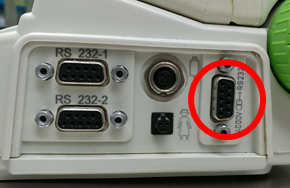
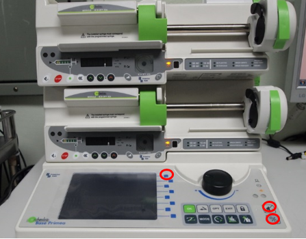
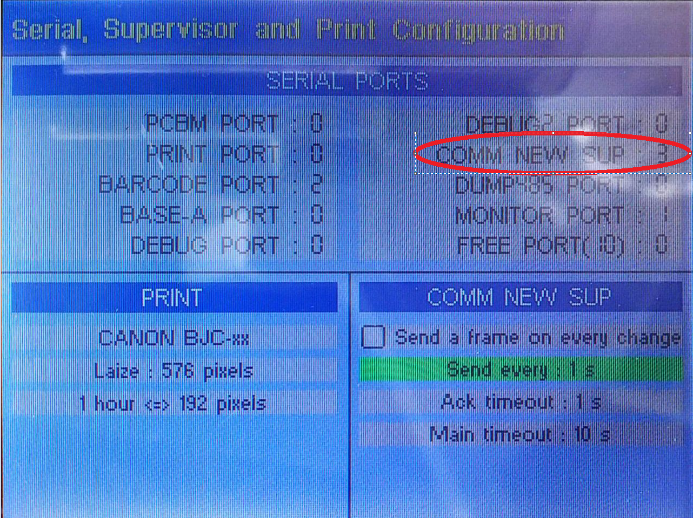
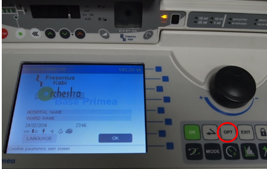
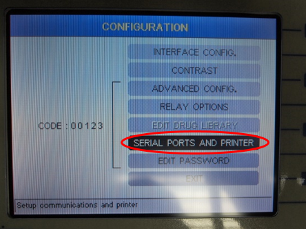
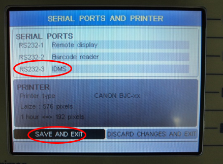

# Fresenius Vial Orchestra (Base Primea with Module DPS)

<!-- meta
category: Syringe Pump
manufacturer: Fresenius Kabi
vr_device_name: Orchestra
-->
> ⚠️ **The port must be configured in service mode.** Connect a **direct serial cable** with a **Null Modem adapter (M/F)** as specified below. Do not use a cross cable or omit the adapter; either can prevent communication.

| Cable | Adapter | Port | Serial | VR Device Name |
|-------|---------|------|--------|----------------|
| direct serial cable (DB-9M ↔ DB-9F) | Null Modem adapter (M/F) | **RS 232-3** (DB-9F) — rightmost of the three serial ports on the Base Primea | IDMS | `Orchestra` |

## Connection Requirements

The Base Primea's serial ports are DB-9 **female**, and the PC side is DB-9 **male**, so a Null Modem adapter (M/F) reverses the wiring and mates with both connectors.

## Connection Steps
1. Identify the serial ports on the rear of the Base Primea. They are labeled **RS 232-1**, **RS 232-2** and **RS 232-3**; **RS 232-3 is the rightmost**, alongside the round connectors, and is the only one used for data export.

   

2. Attach the **Null Modem adapter (M/F)** to **RS 232-3**.
3. Connect a **direct** serial cable from the adapter to the PC, via a USB-Serial converter if the PC has no DB-9 port.

## Device Configuration

Two separate menus must be set: the **service-mode** serial configuration (which assigns the supervisor communication channel to port 3 and sets the transmission interval), and the **customisation** menu (which sets the port's attached-device type to IDMS).

**Part 1 — Service mode: assign COMM NEW SUP to port 3**

1. Power the unit off. Hold the **top blue side button + mute button + power button** together to boot into service mode.

   

2. In **SPECIAL FUNCTIONS**, press the side button next to **"Serial & ..."** (the fourth blue button from the top).

   

3. The **Serial, Supervisor and Print Configuration** screen appears. Using the jog dial, set **COM NEW SUP** (second entry in the right-hand column of **SERIAL PORTS**) to **`3`**.
4. In the **COMM NEW SUP** panel at the lower right, leave **"Send a frame on every change"** unchecked and set **"Send every"** to **`1 s`**.

   

5. Power the unit off, then on again to leave service mode.

**Part 2 — Customisation: set RS 232-3 to IDMS**

6. At the start-up screen (hospital / ward name, date and **LANGUAGE**), press the **OPT** button at the lower right of the front panel.

   

7. In the **OPTIONS MENU**, select **CUSTOMISATION**.

   

8. On the **CONFIGURATION** screen, enter access code **`00123`** in the **CODE** field. Until a valid code is entered the advanced entries (including *Serial ports and printer*) stay greyed out.

   

9. Select **SERIAL PORTS AND PRINTER**, now enabled.

   

10. In **SERIAL PORTS**, open the **RS232-3** entry and select **IDMS** from the drop-down list (*Not connected / Printer / PCBM / PCBM + Printer / IDMS*).

    

11. Confirm the list now reads **RS232-3  IDMS**, then press **SAVE AND EXIT**. Power-cycle the unit for the setting to take effect.

    

    - Choosing **DISCARD CHANGES AND EXIT** here loses the assignment silently, and the unit will record nothing.

## Vital Recorder Setup

- Add the device in Vital Recorder as **`Orchestra`**.

## Troubleshooting

- **The Orchestra connects but produces no tracks.** Confirm both configuration steps: **RS 232-3 → IDMS** and **COMM NEW SUP → 3** in service mode.
- **The pump emits bursts on every keypress instead of a steady 1 s frame.** **"Send a frame on every change"** must stay unchecked; Vital Recorder expects the steady 1 s frame.
- **The access code `00123` is rejected.** Menu wording and code behaviour can differ on other firmware revisions — request the current customisation code from Fresenius Kabi service rather than guessing.

## Notes

- **Vital Recorder versions:** recording from the Orchestra Base Primea (including TCI) has been supported since **0.9.11**.
