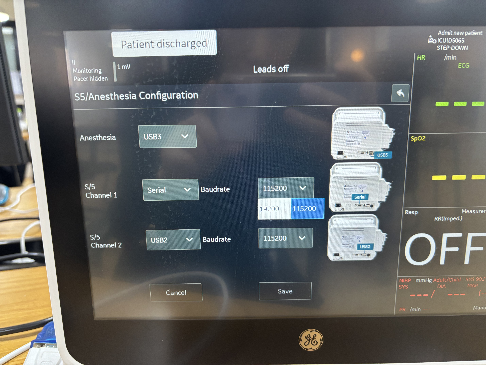

# GE B105M / B115M / B125M

<!-- meta
category: Patient Monitor
manufacturer: GE
vr_device_name: B1x5M
-->
> **Note:** Requires serial port configuration on firmware version 4 and later. See Device Configuration below.

| Cable | Adapter | Port | VR Device Name |
|-------|---------|------|----------------|
| Direct Serial | None | Serial port marked in **red** | `B1x5M` |

## Connection Steps

1. Connect a direct serial cable to the serial port **marked in red** on the rear.
2. Connect the other end to the PC via USB-Serial converter.

## Device Configuration

> **Note:** This configuration is required for firmware **version 4 and later** only.

> ⚠️ **Service login required.** When prompted, enter the credentials below:
>
> | Field | Value |
> |-------|-------|
> | ID | `service` |
> | Password | `lcsmsteam` or `wh1tef1sh` |

1. On the monitor, navigate to **Install/Service → Service → Page 3**.
2. Tap **S5/Anesthesia**.
3. Set **S/5 Channel 1** to **Serial** and **Baudrate** to **19200**.

   

4. Tap **Save**.
